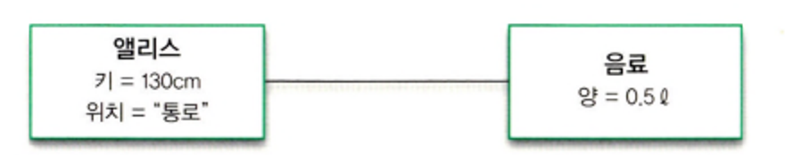
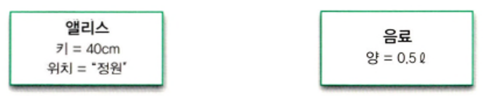

# 02. 이상한 나라의 객체
> 객체지향 패러다임은 지식을 추상화하고 추상화한 지식을 객체 안에 캡슐화함으로써
> 실세계 문제에 내재된 복잡성을 관리하려고 한다. 객체를 발견하고 창조하는 것은 지식과 행동을 구조화하는 문제다.

 

## 객체지향과 인지 능력
많은 사람들이 객체지향을 직관적이고 이해하기 쉬운 패러다임이라고 말하는 이유는
객체지향이 세상을 자율적이고 독립적인 객체들로 분해할 수 있는 인간의 기본적인 인지 능력에 기반을 두고 있기 때문이다.

인간은 좀 더 단순한 객체들로 주변을 분해함으로써 자신이 몸담고 있는 세상을 이해하려고 노력한다.
즉, 객체란 인간이 분명하게 인지하고 구별할 수 있는 물리적인 또는 개념적인 경계를 지닌 어떤 것이다.

하지만 현실 세계와 소프트웨어 세계 사이의 유사성은 여기까지일 뿐이며,
객체지향 패러다임의 목적은 현실 세계를 모방하는 것이 아니라 **새로운 세계를 창조하는 것**이다.

현실 세계의 전등은 사람의 손길 없이 스스로 불을 밝힐 수 없지만 
소프트웨어 세계의 전등은 외부의 도움 없이도 스스로 전원을 켜거나 끌 수 있다.

우리가 알고 있는 세계와 유사해 보이지만 본질적으로는 매우 이질적인 모습을 지닌 객체지향의 세계를 바라볼 수 있다.

 

## 객체, 그리고 이상한 나라
### 앨리스 객체
앨리스는 정원으로 가는 길을 가로막고 있는 작은 문을 통과하기 위해 자신의 키를 줄이거나 늘렸다.
앨리스는 정원으로 통하는 문을 통과하기에 적당한 **상태**로 자신의 키를 계속해서 변화시킨 것이다.

결국 앨리스의 키를 변화시키는 것은 앨리스의 **행동**이며, 하는 행동에 따라 앨리스의 상태가 변하게 된다.
앨리스의 상태를 결정하는 것은 행동이지만 행동의 결과를 결정하는 것은 상태이다. 따라서 행동의 결과는 상태에 의존적이다.

또한, 어떤 행동의 성공 여부는 이전에 어떤 행동들이 발생했는지에 따라 달라지며,
그러므로 행동 간의 순서도 중요한 요소가 될 수 있다는 것이다.

행동에 의해 앨리스의 상태가 변경되더라도 앨리스가 앨리스라는 사실은 변하지 않으며,
앨리스는 상태 변경과 무관하게 유일한 존재로 **식별 가능**하다.

위의 내용들을 정리해 보자면,
- 앨리스는 상태를 가지며 상태는 변경 가능하다.
- 앨리스의 상태를 변경시키는 것은 앨리스의 행동이다.
  - 행동의 결과는 상태에 의존적이며 상태를 이용해 서술할 수 있다.
  - 행동의 순서가 결과에 영향을 미친다.
- 앨리스는 어떤 상태에 있더라도 유일하게 식별 가능하다.

**객체의 특징과 앨리스의 특징들이 중요한 몇 가지를 공유한다.**

 

## 객체, 그리고 소프트웨어 나라
객체의 다양한 특성을 효과적으로 설명하기 위해서는 객체를 **상태(state)**, **행동(behavior)**, **식별자(identity)** 를 지닌 실체로 보는 것이 가장 효과적이다.
이상한 나라의 앨리스는 상태, 행동, 식별자를 지닌 실체다. 객체도 이와 마찬가지다.

객체를 아래와 같이 정의하기로 했다.
> **객체**란 식별 가능한 개체 또는 사물이다. 객체는 자동차처럼 만질 수 있는 구체적인 사물일 수도 있고,
> 시간처럼 추상적인 개념일 수도 있다. 객체는 구별 가능한 식별자, 특징적인 행동, 변경 가능한 상태를 가진다.
> 소프트웨어 안에서 객체는 저장된 상태와 실행 가능한 코드를 통해 구현된다.

### 상태
#### 상태가 왜 필요한가 ?
상태를 이용하면 과거의 모든 행동 이력을 설명하지 않고도 행동의 결과를 쉽게 예측하고 설명할 수 있고,
또한 과거에 얽매이지 않고 현재를 기반으로 객체의 행동 방식을 이해할 수 있다.

#### 상태와 프로퍼티
객체의 상태를 구성하는 모든 특징을 통틀어 객체의 **프로퍼티(property)** 라고 한다.
일반적으로 프로퍼티는 변경되지 않기 때문에 **정적**이며, **프로퍼티 값(property value)** 은 변경되기 때문에 **동적**이다.

  
앨리스가 음료수를 들고 있다면 앨리스 객체와 음료 객체는 서로 연관(연결)되어 있다고 할 수 있다.
하지만 앨리스가 음료수를 버리게 된다면 더 이상 앨리스 객체와 음료 객체는 연관되어 있지 않다는 것이다.

  
위 사진에선 선이 사라진 것을 볼 수 있다. 이처럼 사라진 선을 객체와 객체 사이의 의미 있는 연결을 **링크(link)** 라고하며, 객체와 객체 사이에는 링크가 존재해야만 요청을 보내고 받을 수 있다.
즉, 객체의 링크를 통해서만 메시지를 주고받을 수 있다.

객체를 구성하는 단순한 값은 **속성(attribute)** 이라고 하며, 객체의 프로퍼티는 단순한 값인 속성과 다른 객체를 가리키는 링크라는 두 가지 종류의 조합으로 표현할 수 있다.
- 정확하게 말하면 프로퍼티는 속성과 연관관계의 두 가지 종류로 구분된다. 연관관계는 정적인 관계를 의미하며 링크는 연관관계의 인스턴스다.

객체의 상태에 대해 정의해보자면,
> **상태**는 특정 시점에 객체가 가지고 있는 정보의 집합으로 객체의 구조적 특징을 표현한다.
> 객체의 상태는 객체에 존재하는 정적인 프로퍼티와 동적인 프로퍼티 값으로 구성된다. 객체의 프로퍼티는 단순한 값과 다른 객체를 참조하는 링크로 구분할 수 있다.

객체는 자율적인 존재라는 점을 명심하라. 객체는 스스로의 행동에 의해서만 상태가 변경되는 것을 보장함으로써 객체의 자율성을 유지한다.

### 행동
#### 상태와 행동
객체의 상태는 저절로 변경되지 않는다. 객체의 상태를 변경하는 것은 객체의 자발적인 행동뿐이다.

객체가 취하는 행동을 자신의 상태를 변경시키며, 객체의 행동에 의해 상태가 변경된다는 것은 행동이 **부수 효과(side effect)** 를 초래한다는 것을 의미한다.

상태와 행동 사이에는 다음과 같은 관계가 있다.
- 객체의 행동은 상태에 영향을 받는다
- 객체의 행동은 상태를 변경시킨다

이것은 상태라는 개념을 이용해 다음의 두 가지 관점에서 서술할 수 있다.
- 상호작용이 현재의 상태에 어떤 방식으로 의존하는가
- 상호작용이 어떻게 현재의 상태를 변경시키는가

#### 협력과 행동
객체가 다른 객체와 협력하는 유일한 방법은 요청을 보내는 것이며, 요청을 수신한 객체는 처리하기 위해 적절한 방법에 따라 행동한다.
따라서 객체의 행동은 객체가 협력에 참여할 수 있는 유일한 방법이다.

객체는 협력에 참여하는 과정에서 자기 자신의 상태뿐만 아니라 다른 객체의 상태 변경을 유발할 수도 있다.

정리하면 객체의 행동으로 인해 발생하는 결과는 두 가지 관점에서 설명할 수 있다.
- 객체 자신의 상태 변경
- 행동 내에서 협력하는 다른 객체에 대한 메시지 전송

행동에 대해 정의해보자면,
> **행동**이란 외부의 요청 또는 수신된 메시지에 응답하기 위해 동작하고 반응하는 활동이다. 행동의 결과로 객체는 자신의 상태를 변경하거나 다른 객체에게 메시지를 전달할 수 있다.
> 객체는 행동을 통해 다른 객체와의 협력에 참여하므로 행동은 외부에 가시적이어야 한다.

#### 상태 캡슐화
캡슐화는 자신의 상태를 외부가 알 수 없게 숨기는 것을 뜻하며, 외부에 노출하는 것은 행동뿐이고 외부에서 객체에 접근할 수 있는 유일한 방법 역시 행동뿐이다.

상태를 잘 정의된 행동 집합 뒤로 캡슐화하는 것은 객체의 자율성을 높이고 협력을 단순하고 유연하게 만든다. 이것이 상태를 캡슐화해야 하는 이유다.

## 식별자
객체를 서로 구별할 수 있는 특정한 프로퍼티가 객체 안에 존재하는데, 이 프로퍼티를 **식별자** 라고 한다.

값과 객체의 가장 큰 차이점은 값은 식별자를 가지지 않지만 객체는 가진다는 점이고, 시스템을 설계할 때는 단순한 값과 객체의 차이점을 명확하게 구분하고 명시적으로 표현하는 것이 매우 중요하다.

